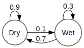

# Markov Chains and Mutation

## Introduction

A Markov chain is a stochastic model describing how a random variable
changes through time. Markov chains are memoryless, and future states
depend only on the current state of the chain and not on any past
states. This is known as the Markov property.

## Discrete-Time Markov Chains

A discrete-time Markov chain is a sequence of random variables generated
by a stochastic process in which the value of the next variable depends
only on the value of the current variable. For example, consider a
simple Markovian weather model in which days are either dry or wet. If
today is dry, then tomorrow has a 90% chance of being dry and a 10%
chance of being wet. If today is wet, then tomorrow has a 30% chance of
being wet and a 70% chance of being dry. Whatever happens tomorrow is
conditionally independent of what happened yesterday. This can be
represented by a graphical model with two states and four edges.

<figure>

<figcaption aria-hidden="true">An example graphical model.</figcaption>
</figure>

This information can also be represented using a matrix describing the
transition from today to tomorrow:

``` math
P = \left[
\begin{matrix}
0.9 & 0.1\\
0.7 & 0.3\\
\end{matrix}
\right]
```

### Definition

A discrete-time Markov chain is a sequence of random variables
$`X_0, X_1, X_2, \ldots`$ with the Markov property:

``` math
\Pr(X_{n+1} = x | X_0 = x_0, X_1 = x_1, \ldots , X_n = x_n) = \Pr(X_{n+1} = x | X_n = x_n)
```

Assuming time-homogeneity, the behavior of this chain can be encoded
into a single transition matrix, $`P`$, such that
$`p_{ij} = \Pr(X_{n+1} = j | X_n = i)`$.

Let $`\pi^{(n)}`$ be (row) vector describing the distribution of states
of the chain at time $`t=n`$, i.e. $`\pi^{(n)}_i = \Pr(X_{n} = i)`$,
where $`(n)`$ is an index and not a power. This vector can be calculated
from $`\pi^{(n-1)}`$ using matrix multiplication:

``` math
\pi^{(n)} = \pi^{(n-1)} \times P = \pi^{(n-2)} \times P \times P = \pi^{(0)} \times P^n
```

where $`\pi^{(0)}`$ represents the initial distribution of states at
time $`t = 0`$.

### Mutation

Consider a haploid DNA locus for four states $`X \in \{1, 2, 3, 4\}`$.
These states could represent different nucleotides or different alleles.
The transmission of this locus from one generation to the next can be
represented by a transition matrix

``` math
P = \begin{bmatrix}
 1 - (u_{12} + u_{13} + u_{14}) & u_{12} & u_{13} & u_{14}\\
u_{21} & 1 - (u_{21} + u_{23} + u_{24}) & u_{23} & u_{24}\\
u_{31} & u_{32} & 1 - (u_{31} + u_{32} + u_{34}) & u_{34}\\
u_{41} & u_{42} & u_{43} & 1 - (u_{41} + u_{42} + u_{43})\\
\end{bmatrix}
```

where the off diagonals represent mutation events and the diagonals
represent no mutation. If this locus is transmitted clonally
(e.g. mitochondrial DNA), then $`\Pr(X_n = j | X_0 = i) = P^{(n)}_{ij}`$
where $`P^{(n)} = P^n`$.

#### Probability of No Mutations

$`\Pr(X_n = i | X_0 = i)`$ does not measure the probability that no
mutation occurred, only that the state is the same after $`n`$
generations. To calculate
$`\Pr(X_n = j \text{ and zero mutations} | X_0 = i)`$, we will first
first split $`P`$ into two matrices, $`P = Z + J`$, such that $`Z`$
contains the diagonal elements of $`P`$ and $`J`$ contains the
off-diagonals. From here, it is straightforward to calculate

``` math
\left[\Pr(X_n = j \text{ and zero mutations} | X_0 = i)\right] = Z^n
```

#### Probability of One Mutation

If one and only one mutation occurred across $`n`$ generations, then
there are $`n`$ possible time points when the mutation occurred. The
probability of one and only one mutation occurring across $`n`$
generations can be calculated by summing over all possible time points.

``` math
\label{eq:dtmconemut}\tag{1}\begin{align}
\Pr(X_n = j \text{ and one mutation} | X_0 = i) = &
\left[\sum_{k=1}^n Z^{k-1} J^1 Z^{n-k}\right]_{ij}\\
= & \sum_{k=1}^n p_{ii}^{k-1} p_{ij} p_{jj}^{n-k}\\
= & p_{ij} \frac{p_{ii}^n - p_{jj}^n}{p_{ii}-p_{jj}} : p_{ii} \ne p_{jj}\\
= & n p_{ij} p_{ii}^{n-1} : p_{ii} = p_{jj}
\end{align}
```

## Continuous-Time Markov Chains

A continuous-time Markov chain is similar to a discrete-time Markov
chain, except that transitions between states are not restricted to
occur at discrete time points. Here, if we know the state of the
stochastic process at a specific time point, then what will happens in
the future is independent of what happened in the past.

In the continuous-time analog of our weather model, being wet or dry is
now a property of every specific point of time and not restricted to
daily summary.

### Definition

Let $`X_t`$ be a random variable representing the state of a
continuous-time Markov chain at time $`t`$. Therefore, following the
Markov property, if $`X_t`$ is known and $`h > 0`$, then $`X_{t+h}`$ is
independent of $`X_s`$ for all $`s < t`$. The conditional probability
that $`X_{t+h} = j`$ given $`X_t = i`$ can be defined as $`h \to 0`$ as

``` math
\Pr(X_{t+h} = j | X_t = i) = \delta_{ij} + q_{ij} h + o(h)
```

where $`\delta_{ij}`$ is the Kronecker delta and $`q_{ij}`$ is
non-negative if $`i \ne j`$. Here $`q_{ij}`$ represents how quickly the
transition from $`i`$ to $`j`$ happens.

Let $`P(h)`$ be the transition matrix representing the conditional
transition between the starting and end points of a time span of length
$`h`$. Consistent with the definition above, $`P(h) \approx I + Qh`$ as
$`h \to 0`$, where $`I`$ is the identity matrix and $`Q`$ is the
transition rate matrix. The elements of $`Q`$ are defined as above where
$`q_{ij}`$ is non-negative if $`i \ne j`$, and
$`q_{ii} = - \sum_{j : j \ne i} q_{ij}`$ is chosen such that the every
row sums to 0.

Now consider a time span of length $`t`$, subdivided into $`n`$
independent sections. Since the subdivisions are independent, the total
transition matrix is the product of the transition matrices of the
individual subdivisions:

``` math
P(t) \approx \left(I + \frac{Qt}{n} \right)^n
```

If we take the limit as $`n \to \infty`$, we get the formula for
$`P(t)`$ using matrix exponentiation:

``` math
\left[\Pr(X_t = j | X_0 = i)\right] = P(t) = \lim_{n \to \infty} \left(I + \frac{Qt}{n} \right)^n = e^{Qt}
```

#### K-alleles Model

In a K-alleles model there are a total of $`k`$ different alleles, and
the mutation rates between alleles are identical. Under this model,
$`q_{ij} = \frac{1}{k-1}`$ if $`i \ne j`$, and $`-1`$ if $`i = j`$.

#### Probability of No Mutations

As above, let $`Z`$ hold the diagonal entries of $`Q`$ and $`J`$ hold
the off-diagonals, such that $`Q = Z + J`$. Next let
$`P^0(t) = \left[p^{(0)}_{ij}(t)\right]`$, where
$`p^{(0)}_{ij}(t) = \Pr(X_t = j \text{ and no mutations} | X_0 = i)`$.
Therefore,

``` math
P^{(0)}(t) = \lim_{n \to \infty} \left(I + \frac{Zt}{n} \right)^n = e^{Zt}
```

#### Probability of One Mutation

Define $`P^{(1)}(t)`$ similar to $`P^{(0)}(t)`$ as the joint probability
of $`X_t`$ and one mutation given $`X_0`$.

``` math
\
P^{(1)}(t) = \lim_{n \to \infty} \sum_{k=1}^n
\left(I + \frac{Zt}{n} \right)^{k-1}
\frac{J t}{n} \left(I + \frac{Zt}{n} \right)^{n-1}\
```

Following Equation , if $`q_{ii} = q_{jj}`$ then

``` math
p^{(1)}_{ij}(t) = \lim_{n \to \infty}
n \frac{q_{ij} t}{n}\left(I + \frac{q_{ii}t}{n} \right)^{n-1} =
q_{ii} t e^{q_{ii} t}
```

If $`q_{ii} \ne q_{ij}`$,

``` math
\begin{align}
p^{(1)}_{ij}(t) = & \lim_{n \to \infty}
\frac{q_{ij} t}{n} \frac{\left(I + \frac{q_{ii}t}{n} \right)^n - \left(I + \frac{q_{jj}t}{n} \right)^n}{\left(I + \frac{q_{ii}t}{n} \right)-\left(I + \frac{q_{jj}t}{n} \right)}\\
= & q_{ij} t \frac{e^{q_{ii}t} - e^{q_{jj}t}}{q_{ii}t - q_{jj} t}
\end{align}
```

#### Expected number of Mutations

The expected number of mutations conditional on the beginning and end
points is calculated as

``` math
E\left[K | X_t = j, X_0 = i\right] = \sum_{k=0}^\infty k \frac{p^{(k)}_{ij}(t)}{p_{ij}(t)} =  \frac{\sum_{k=0}^\infty k p^{(k)}_{ij}(t)}{p_{ij}(t)}
```

The numerator can be calculated using matrix operations as

``` math
\left[\sum_{k=0}^\infty k p^{(k)}_{ij}(t) \right] = \sum_{k=0}^\infty k \frac{\left(J t\right)^k}{k!} e^{Zt} = J t e^{j t}e^{Zt} = Jt e^{Qt}
```

Since the denominator is $`e^{Qt}`$, we can find the expected value
using element-wise division.

``` math
\left[E\left[K | X_t = j, X_0 = i\right]\right] = \frac{Jt e^{Qt}}{e^{Qt}}
```

Note that $`e^{Qt}`$ does not cancel out in the numerator and the
denominator since it is part of a matrix multiplication in the
numerator.

Assuming that the process has converged to its stationary distribution,
the expected number of mutations over time $`t`$ can be calculated by
averaging over the starting and ending points

``` math
E[K] = \sum_{i,j} E\left[K | X_t = j, X_0 = i\right] \Pr( X_t = j, X_0 = i) = \sum_{i,j} \left[\pi Jt e^{Qt}\right]_{ij}
```

where $`\pi`$ is the stationary distribution row vector. $`\pi`$ can be
found by solving the equation $`\pi Q = 0`$ with the constraint that
$`\sum_i \pi_i = 1`$. First note that $`\pi J = -\pi Z`$ because
$`\pi Q = 0`$. Then

``` math
\pi Jt e^{Qt} = t \pi J e^{Qt} = -t \pi Z e^{Qt} = -t \pi e^{Qt} Z = -t \pi Z
```

If $`Q`$ has been normalized such that
$`\sum_{i,j} \pi J = \sum_{i,j} -\pi Z = 1`$, which is common, then

``` math
E[K] =  \sum_{i,j} \left[\pi Jt e^{Qt}\right]_{ij} = t
```
